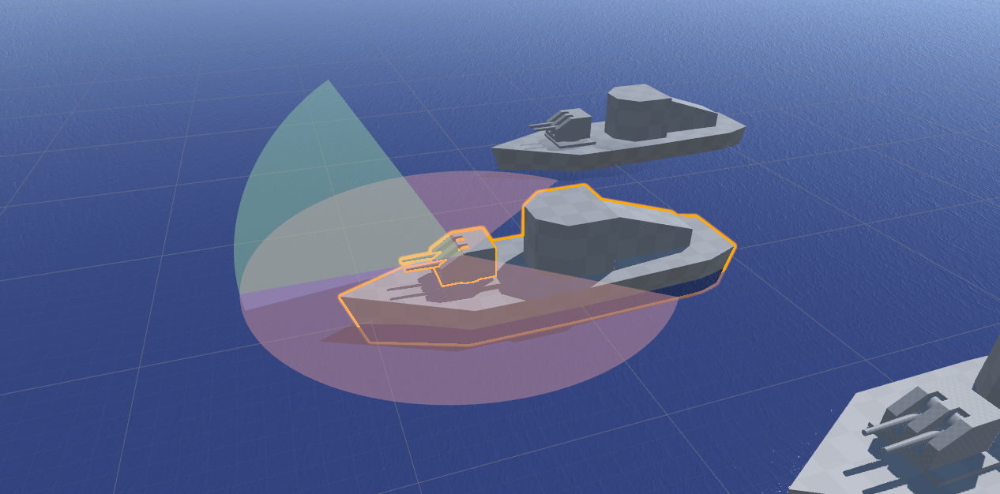
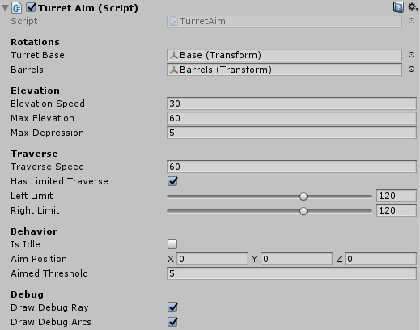
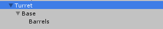
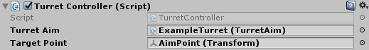
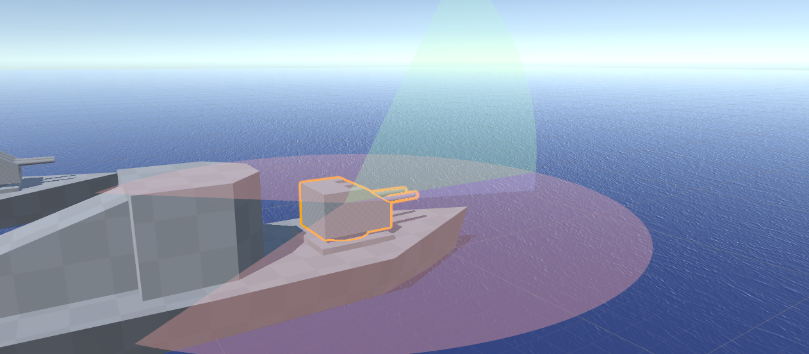
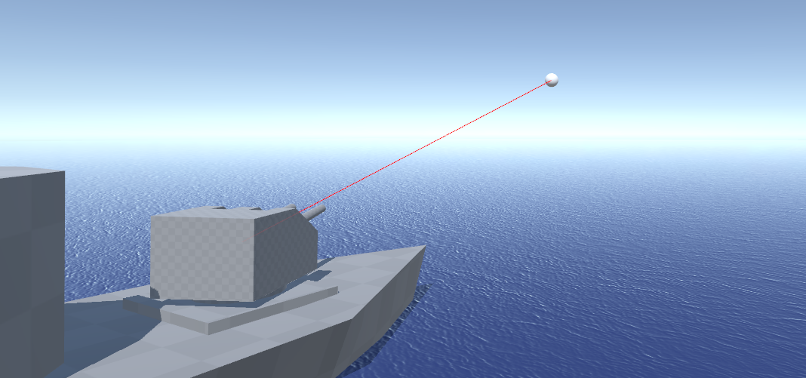

# Gun Turrets 2
Starting point for turrets that can be mounted on objects that move and can be at any arbitrary rotation. This project specifically works out the **rotation** of turrets. You're meant to provide your own weapon systems.

This is a more robust version of my previous [GunTurrets project on GitHub](https://github.com/brihernandez/GunTurrets). This version specifically fixes the two known issues from that project:

* When a target passes behind the turret, and it's using a limited traverse where the limits are >90 degrees, the turret would ignore the traverse limits and go the wrong way around.
* When a target is perpendicular to the turret, the barrels would try to elevate to 90 degrees straight up.

This turret is 60-90% slower than the older turrets, however in my experience the turret aim code has never been the bottleneck in any of the games I've worked on. There are always much more expensive processes. At least on my machine, the aiming script is still lightweight enough that you shouldn't run into problems unless you're running thousands of them. [Here's an example of ~1200 turrets at ~120 FPS](https://www.youtube.com/watch?v=AWNsofcZhSc).

Built in **Unity 2017.4.37f1**.

## Download

You can either clone the repository or **[download the asset package](./GunTurrets2.unitypackage)** located in the root.

## Usage

To aim the turret simply set the public property `AimPosition`. If the turret is not currently idle, it will turn to aim at this target.

At any time, the turret can be put into (or out of) Idle mode setting the public property `IsIdle`. When the turret is idle, it will return to its resting position of forwards. Note that the aimpoint remains set, and if the turret is brought out of idle, it will continue to aim at whatever the last aimpoint was set to.

Limitations can be placed on the turret rotations for left/right traverse and barrel elevation/depression.

## Turret Aim

The core script of this project. This assumes a turret with a base gameobject/transform for horizontal rotation, and a barrel gameobject/transform for the vertical rotation. This covers the majority of cases for how turrets operate.

Included in the project is an archetype prefab that can be used as a basis for any turrets you might need to create. It's already configured, and only requires you to customize it to your needs and swap out the models.

### Properties
One of the new additions from [the old turret code](https://github.com/brihernandez/GunTurrets) is a handful of useful properties.

* **HasLimitedTraverse:** True when the turret cannot rotate freely in the horizontal axis.
* **IsTurretAtRest:** True when the turret is idle and at its resting position.
* **IsAimed:** True when the turret is aimed at the given `AimPosition`. When the turret is idle, this is never true.
* **AngleToTarget:** Angle in degrees to the given `AimPosition`. When the turret is idle, the angle reports 999.

### Turret Hierarchy

Turrets must follow a specific hierarchy. The image below shows an example.

An **empty gameobject**, (Turret) must be the root object. This is the gameobject with the `TurretRotation` script on it.

The **turret base object** (Base) must then be a child of the root object. This game object handles the horizontal rotation of the turret.

Finally, the **barrels object** (Barrels) must be a child of the turret base object. This object handles the elevation of the barrels. If you add a gun or missile launcher to the turret, it's recommended to make the gun (or at least the barrels it fires from) a child of this barrel object.

If an elevating barrel isn't required for a turret design, the component will still function fine without it. The turret continues to rotate horizontally to face whatever aim point it's given.

## Turret Controller

A very simple example script using `TurretAim`. It will tell a specific TurretAim to look at a target, and will toggle it idle on left mouse click.

## Visualizations

### Show Arcs

Visualizes the firing arcs of the turret.

- Red: Azimuthal left/right limits. How far to the left/right that the turret can turn.
- Green: Elevation. How far the turret can raise its barrels.
- Blue: Depression. How far the turret can lower its barrels.

### Show Debug Ray

Draws a ray from the barrel's transform to the specified target. Used to debug turret aiming. If there are no barrels, the ray will be drawn from the turret's rotating base.

The ray is not drawn while the turret is idle.

# Change log

### 1.0 (March 14 2020)

- Released
